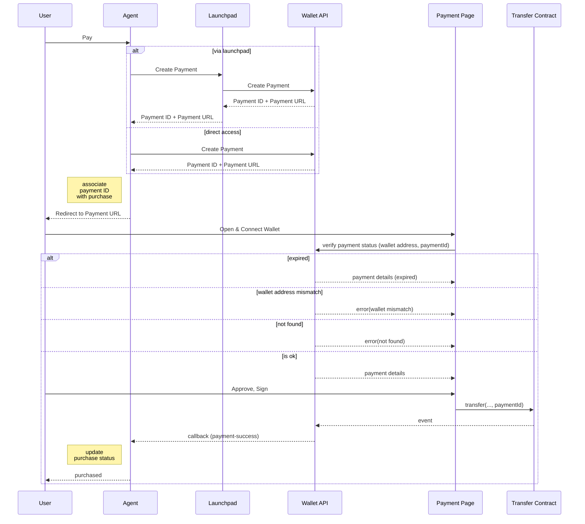

import { Steps, Callout} from 'nextra/components'

# Agent Payment

## Payment Flow

The Agent Wallet API provides APIs and infrastructure catering both for user-to-agent payment and for agent-to-agent payment scenarios.

The general payment flow is as follows:

<Steps>
### Initialize Payment

Agent initializes the payment with essential payment details, e.g. the amount of the payment, the token etc. Agent talks to the Launchpad API or directly to the Wallet API, and gets a payment ID and a payment URL. The payment ID should be recored on the Agent's side and associated with the purchase.

<Callout type="info">
Communicating directly with the Wallet API will be supported in the future.
</Callout>

### Redirect User or show Payment UI

Agent redirects user to the payment URL, or shows a customized payment UI to the user.

### User Interact with Payment Contract

User interacts with the payment smart contract either via the pre-built payment page or an agent-provided payment UI. If the pre-built payment is used, the payment status and info will be verified before the user can proceed with the payment.

User will need to connect to their wallet and approve/sign the transaction. The payment ID must be correctly past to the payment contract call for the payment status to be properly tracked.

### Payment Status Tracking

The Wallet API will monitor the blockchain for the payment event, once the payment is completed and the details of the trancation verified, the Agent will be notified via the callback API. Then Agent can update the purchuse status and any other associated states and finally notify the user of the payment success.
</Steps>

## Pre-built Payment Page

The Agent can redirect user to a pre-built payment page hosted on agentlayer.xyz for the payment, which spares a lot of effort for the Agent developers to build their own payment logic and UI. However, the Agent is free to provide a customized payment UI, as long as the user interacts with the payment smart contract with the payment ID.

## Sequence Diagram

